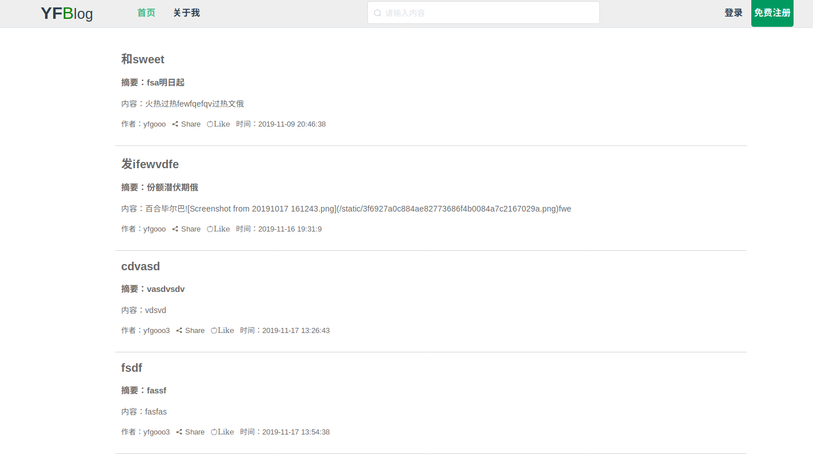
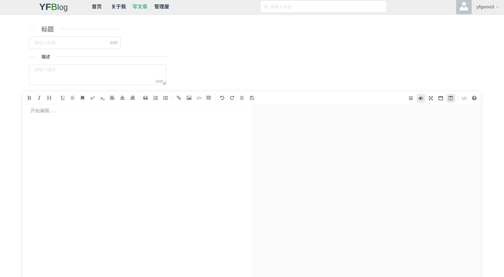
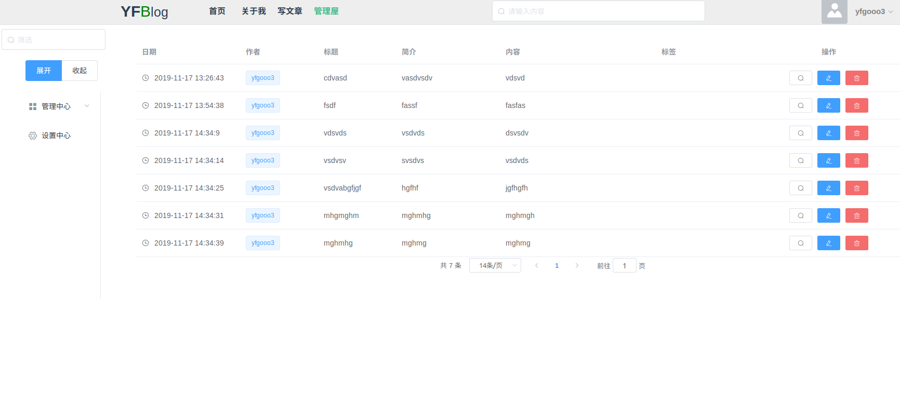

# vue-go-blog
本博客项目基于vue+element-ui以及gin框架搭建 
本意是验证自己前后端能力。 
本博客会用于记录我的日常生活，同时也作为我的学习笔记。
不定期更新，后期会用typescript整个项目

## docker(用于快速启动mysql和redis)
    cd docker 
    docker-compose up -d
    
## singo(使用golang的gin框架搭建后端接口，使用gorm操控数据库)
    cd singo
    export GOPROXY=https://mirrors.aliyun.com/goproxy/
    export GO111MODULE=on
    go run main.go

## vue(采用vuejs+element-ui 编写博客前端界面)
    cd vue
    npm install
    npm run serve
    
## 界面展示
### 首页

### 编辑页

### 管理页

## To list:
    1.登录页面(Done)
    2.图片上传接口(Done)
    3.文章接口(Done)
    4.文章显示(Done)
    5.首页展示(Done)
    6.编辑页展示(Done)
    7.搜索功能(Done)
    8.分页功能(Done)
    9.文章管理(Done)
    10.redis统计访问量
    11.打包docker镜像
    12.搭建gitlab ci/cd实现一键部署
    13.增加视频上传以及管理功能
    14.增加人工智能模块

yum -y install openssl*

openssl genrsa -des3 -out server.key 1024            # 用于生成rsa私钥文件

openssl req -new -key server.key -out server.csr     # openssl req 用于生成证书请求

openssl rsa -in server.key -out server_nopwd.key     #利用openssl进行RSA为公钥加密

openssl x509 -req -days 365 -in server.csr -signkey server_nopwd.key -out server.crt

mv server.crt server_nopwd.key /usr/local/nginx/conf/

## 参考了
    https://github.com/bydmm/singo
    https://github.com/pppercyWang/twitter-blog-vue

